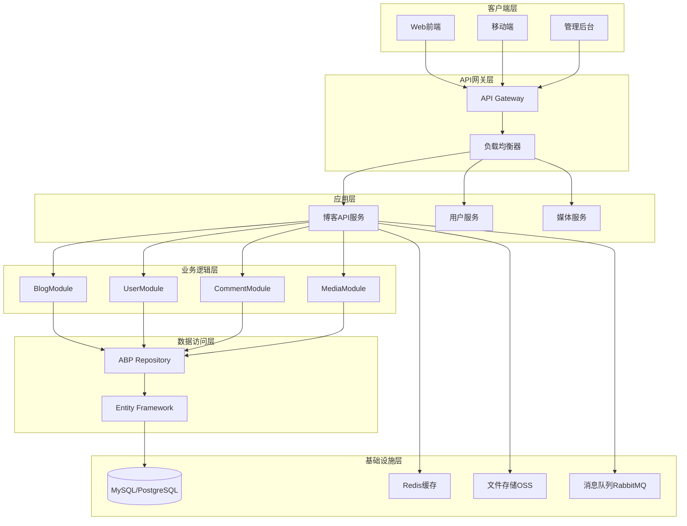

# ABP博客后端系统设计文档

## 1. 系统架构设计

### 1.1 整体架构图



### 1.2 ABP分层架构

```
BlogBackend.sln
├── src/
│   ├── BlogBackend.Domain/               # 领域层
│   │   ├── Entities/                     # 实体
│   │   ├── Services/                     # 领域服务
│   │   └── Repositories/                 # 仓储接口
│   ├── BlogBackend.Domain.Shared/        # 领域共享
│   │   ├── Enums/                        # 枚举
│   │   └── Constants/                    # 常量
│   ├── BlogBackend.Application.Contracts/ # 应用服务合约
│   │   ├── DTOs/                         # 数据传输对象
│   │   └── Services/                     # 应用服务接口
│   ├── BlogBackend.Application/          # 应用层
│   │   ├── Services/                     # 应用服务实现
│   │   └── AutoMapper/                   # 对象映射
│   ├── BlogBackend.EntityFrameworkCore/ # 数据访问层
│   │   ├── Repositories/                 # 仓储实现
│   │   ├── Configurations/               # EF配置
│   │   └── DbContext/                    # 数据库上下文
│   ├── BlogBackend.HttpApi/              # HTTP API层
│   │   └── Controllers/                  # 控制器
│   └── BlogBackend.HttpApi.Host/         # API宿主
│       ├── Properties/
│       ├── wwwroot/
│       └── Program.cs
├── test/                                 # 测试项目
└── docker/                              # Docker配置
```

## 2. 领域模型设计

### 2.1 核心实体设计

#### 2.1.1 博客文章实体 (BlogPost)
_满足需求：2.2.1_

```csharp
public class BlogPost : AuditedAggregateRoot<Guid>, IMultiTenant
{
    public Guid? TenantId { get; set; }
    public string Title { get; set; }
    public string Slug { get; set; }
    public string Content { get; set; }
    public string Summary { get; set; }
    public string CoverImage { get; set; }
    public BlogPostStatus Status { get; set; }
    public DateTime? PublishedTime { get; set; }
    public Guid AuthorId { get; set; }
    public Guid CategoryId { get; set; }
    public int ViewCount { get; set; }
    public int LikeCount { get; set; }
    public int CommentCount { get; set; }
    public string MetaTitle { get; set; }
    public string MetaDescription { get; set; }
    public string MetaKeywords { get; set; }
    
    // 导航属性
    public virtual BlogUser Author { get; set; }
    public virtual BlogCategory Category { get; set; }
    public virtual ICollection<BlogPostTag> PostTags { get; set; }
    public virtual ICollection<BlogComment> Comments { get; set; }
}
```

#### 2.1.2 用户实体扩展 (BlogUser)
_满足需求：2.1.1, 2.1.2_

```csharp
public class BlogUser : IdentityUser
{
    public string DisplayName { get; set; }
    public string Bio { get; set; }
    public string Avatar { get; set; }
    public string Website { get; set; }
    public string Location { get; set; }
    public DateTime? Birthday { get; set; }
    public BlogUserStatus Status { get; set; }
    public int PostCount { get; set; }
    public int FollowersCount { get; set; }
    public int FollowingCount { get; set; }
    
    // 导航属性
    public virtual ICollection<BlogPost> Posts { get; set; }
    public virtual ICollection<BlogComment> Comments { get; set; }
}
```

#### 2.1.3 分类实体 (BlogCategory)
_满足需求：2.2.2_

```csharp
public class BlogCategory : AuditedAggregateRoot<Guid>, IMultiTenant
{
    public Guid? TenantId { get; set; }
    public string Name { get; set; }
    public string Slug { get; set; }
    public string Description { get; set; }
    public string Icon { get; set; }
    public string Color { get; set; }
    public int Sort { get; set; }
    public Guid? ParentId { get; set; }
    public int PostCount { get; set; }
    
    // 导航属性
    public virtual BlogCategory Parent { get; set; }
    public virtual ICollection<BlogCategory> Children { get; set; }
    public virtual ICollection<BlogPost> Posts { get; set; }
}
```

#### 2.1.4 标签实体 (BlogTag)
_满足需求：2.2.3_

```csharp
public class BlogTag : AuditedAggregateRoot<Guid>, IMultiTenant
{
    public Guid? TenantId { get; set; }
    public string Name { get; set; }
    public string Slug { get; set; }
    public string Description { get; set; }
    public string Color { get; set; }
    public int UsageCount { get; set; }
    
    // 导航属性
    public virtual ICollection<BlogPostTag> PostTags { get; set; }
}
```

#### 2.1.5 评论实体 (BlogComment)
_满足需求：2.3.1_

```csharp
public class BlogComment : AuditedAggregateRoot<Guid>, IMultiTenant
{
    public Guid? TenantId { get; set; }
    public Guid PostId { get; set; }
    public Guid AuthorId { get; set; }
    public Guid? ParentId { get; set; }
    public string Content { get; set; }
    public BlogCommentStatus Status { get; set; }
    public int LikeCount { get; set; }
    public string AuthorEmail { get; set; }
    public string AuthorName { get; set; }
    public string AuthorWebsite { get; set; }
    public string IpAddress { get; set; }
    public string UserAgent { get; set; }
    
    // 导航属性
    public virtual BlogPost Post { get; set; }
    public virtual BlogUser Author { get; set; }
    public virtual BlogComment Parent { get; set; }
    public virtual ICollection<BlogComment> Replies { get; set; }
}
```

### 2.2 枚举定义

```csharp
public enum BlogPostStatus
{
    Draft = 0,
    Published = 1,
    Archived = 2,
    Deleted = 3
}

public enum BlogUserStatus
{
    Active = 0,
    Inactive = 1,
    Suspended = 2,
    Deleted = 3
}

public enum BlogCommentStatus
{
    Pending = 0,
    Approved = 1,
    Rejected = 2,
    Spam = 3
}
```

## 3. 应用服务设计

### 3.1 博客文章应用服务
_满足需求：2.2.1_

```csharp
public interface IBlogPostAppService : ICrudAppService<
    BlogPostDto,
    Guid,
    GetBlogPostListInput,
    CreateUpdateBlogPostDto>
{
    Task<BlogPostDto> GetBySlugAsync(string slug);
    Task<BlogPostDto> PublishAsync(Guid id);
    Task<BlogPostDto> UnpublishAsync(Guid id);
    Task<ListResultDto<BlogPostDto>> GetPopularPostsAsync(int count);
    Task<ListResultDto<BlogPostDto>> GetRecentPostsAsync(int count);
    Task IncrementViewCountAsync(Guid id);
    Task<BlogPostDto> LikeAsync(Guid id);
    Task<BlogPostDto> UnlikeAsync(Guid id);
}
```

### 3.2 分类应用服务
_满足需求：2.2.2_

```csharp
public interface IBlogCategoryAppService : ICrudAppService<
    BlogCategoryDto,
    Guid,
    GetBlogCategoryListInput,
    CreateUpdateBlogCategoryDto>
{
    Task<ListResultDto<BlogCategoryDto>> GetHierarchyAsync();
    Task<ListResultDto<BlogPostDto>> GetCategoryPostsAsync(Guid categoryId, GetBlogPostListInput input);
    Task RecalculatePostCountAsync(Guid id);
}
```

### 3.3 评论应用服务
_满足需求：2.3.1_

```csharp
public interface IBlogCommentAppService : ICrudAppService<
    BlogCommentDto,
    Guid,
    GetBlogCommentListInput,
    CreateUpdateBlogCommentDto>
{
    Task<ListResultDto<BlogCommentDto>> GetPostCommentsAsync(Guid postId);
    Task<BlogCommentDto> ApproveAsync(Guid id);
    Task<BlogCommentDto> RejectAsync(Guid id);
    Task<BlogCommentDto> ReplyAsync(Guid parentId, CreateBlogCommentDto input);
    Task<BlogCommentDto> LikeAsync(Guid id);
}
```

## 4. 数据访问层设计

### 4.1 数据库表设计

#### 4.1.1 核心表结构

```sql
-- 博客文章表
CREATE TABLE blog_posts (
    id CHAR(36) PRIMARY KEY,
    tenant_id CHAR(36) NULL,
    title VARCHAR(200) NOT NULL,
    slug VARCHAR(200) NOT NULL UNIQUE,
    content LONGTEXT NOT NULL,
    summary TEXT,
    cover_image VARCHAR(500),
    status TINYINT NOT NULL DEFAULT 0,
    published_time DATETIME NULL,
    author_id CHAR(36) NOT NULL,
    category_id CHAR(36) NOT NULL,
    view_count INT NOT NULL DEFAULT 0,
    like_count INT NOT NULL DEFAULT 0,
    comment_count INT NOT NULL DEFAULT 0,
    meta_title VARCHAR(200),
    meta_description VARCHAR(300),
    meta_keywords VARCHAR(500),
    creation_time DATETIME NOT NULL,
    creator_id CHAR(36),
    last_modification_time DATETIME,
    last_modifier_id CHAR(36),
    is_deleted BOOLEAN NOT NULL DEFAULT FALSE,
    deleter_id CHAR(36),
    deletion_time DATETIME,
    INDEX idx_slug (slug),
    INDEX idx_author_id (author_id),
    INDEX idx_category_id (category_id),
    INDEX idx_status (status),
    INDEX idx_published_time (published_time)
);

-- 分类表
CREATE TABLE blog_categories (
    id CHAR(36) PRIMARY KEY,
    tenant_id CHAR(36) NULL,
    name VARCHAR(100) NOT NULL,
    slug VARCHAR(100) NOT NULL UNIQUE,
    description TEXT,
    icon VARCHAR(100),
    color VARCHAR(20),
    sort INT NOT NULL DEFAULT 0,
    parent_id CHAR(36) NULL,
    post_count INT NOT NULL DEFAULT 0,
    creation_time DATETIME NOT NULL,
    creator_id CHAR(36),
    last_modification_time DATETIME,
    last_modifier_id CHAR(36),
    INDEX idx_slug (slug),
    INDEX idx_parent_id (parent_id),
    INDEX idx_sort (sort)
);

-- 标签表
CREATE TABLE blog_tags (
    id CHAR(36) PRIMARY KEY,
    tenant_id CHAR(36) NULL,
    name VARCHAR(100) NOT NULL,
    slug VARCHAR(100) NOT NULL UNIQUE,
    description TEXT,
    color VARCHAR(20),
    usage_count INT NOT NULL DEFAULT 0,
    creation_time DATETIME NOT NULL,
    creator_id CHAR(36),
    last_modification_time DATETIME,
    last_modifier_id CHAR(36),
    INDEX idx_slug (slug),
    INDEX idx_usage_count (usage_count)
);

-- 文章标签关联表
CREATE TABLE blog_post_tags (
    post_id CHAR(36) NOT NULL,
    tag_id CHAR(36) NOT NULL,
    PRIMARY KEY (post_id, tag_id),
    FOREIGN KEY (post_id) REFERENCES blog_posts(id),
    FOREIGN KEY (tag_id) REFERENCES blog_tags(id)
);
```

### 4.2 仓储接口设计

```csharp
public interface IBlogPostRepository : IRepository<BlogPost, Guid>
{
    Task<BlogPost> FindBySlugAsync(string slug);
    Task<List<BlogPost>> GetPublishedPostsAsync(int skipCount = 0, int maxResultCount = 10);
    Task<List<BlogPost>> GetPostsByCategoryAsync(Guid categoryId, int skipCount = 0, int maxResultCount = 10);
    Task<List<BlogPost>> GetPostsByTagAsync(Guid tagId, int skipCount = 0, int maxResultCount = 10);
    Task<List<BlogPost>> GetPopularPostsAsync(int count);
    Task<List<BlogPost>> GetRecentPostsAsync(int count);
    Task IncrementViewCountAsync(Guid id);
}
```

## 5. 缓存策略设计

### 5.1 缓存架构
_满足需求：2.5.2_

```
Redis缓存层级：
├── L1: 应用内存缓存 (IMemoryCache)
├── L2: Redis分布式缓存
└── L3: 数据库
```

### 5.2 缓存键设计

```csharp
public static class CacheKeys
{
    public const string BlogPostPrefix = "blog:post:";
    public const string BlogCategoryPrefix = "blog:category:";
    public const string BlogTagPrefix = "blog:tag:";
    public const string PopularPosts = "blog:popular-posts";
    public const string RecentPosts = "blog:recent-posts";
    public const string CategoryHierarchy = "blog:category-hierarchy";
    public const string TagCloud = "blog:tag-cloud";
    
    public static string GetPostBySlug(string slug) => $"{BlogPostPrefix}slug:{slug}";
    public static string GetPostById(Guid id) => $"{BlogPostPrefix}id:{id}";
    public static string GetCategoryPosts(Guid categoryId) => $"{BlogCategoryPrefix}{categoryId}:posts";
}
```

### 5.3 缓存策略

| 数据类型 | 缓存时间 | 失效策略 |
|---------|---------|---------|
| 文章详情 | 1小时 | 文章更新时失效 |
| 分类列表 | 24小时 | 分类变更时失效 |
| 标签云 | 6小时 | 标签使用变更时失效 |
| 热门文章 | 30分钟 | 定时刷新 |
| 最新文章 | 5分钟 | 新文章发布时失效 |

## 6. API接口设计

### 6.1 RESTful API规范

```
GET    /api/posts                    # 获取文章列表
GET    /api/posts/{id}               # 获取文章详情
GET    /api/posts/slug/{slug}        # 根据slug获取文章
POST   /api/posts                    # 创建文章
PUT    /api/posts/{id}               # 更新文章
DELETE /api/posts/{id}               # 删除文章
POST   /api/posts/{id}/publish       # 发布文章
POST   /api/posts/{id}/unpublish     # 撤回文章
POST   /api/posts/{id}/like          # 点赞文章
POST   /api/posts/{id}/view          # 增加浏览量

GET    /api/categories               # 获取分类列表
GET    /api/categories/{id}/posts    # 获取分类下的文章
POST   /api/categories               # 创建分类
PUT    /api/categories/{id}          # 更新分类
DELETE /api/categories/{id}          # 删除分类

GET    /api/tags                     # 获取标签列表
GET    /api/tags/{id}/posts          # 获取标签下的文章
POST   /api/tags                     # 创建标签

GET    /api/comments                 # 获取评论列表
GET    /api/posts/{id}/comments      # 获取文章评论
POST   /api/comments                 # 创建评论
PUT    /api/comments/{id}            # 更新评论
DELETE /api/comments/{id}            # 删除评论
POST   /api/comments/{id}/approve    # 审核通过
POST   /api/comments/{id}/reject     # 审核拒绝
```

### 6.2 DTO设计

```csharp
public class BlogPostDto : AuditedEntityDto<Guid>
{
    public string Title { get; set; }
    public string Slug { get; set; }
    public string Content { get; set; }
    public string Summary { get; set; }
    public string CoverImage { get; set; }
    public BlogPostStatus Status { get; set; }
    public DateTime? PublishedTime { get; set; }
    public Guid AuthorId { get; set; }
    public string AuthorName { get; set; }
    public Guid CategoryId { get; set; }
    public string CategoryName { get; set; }
    public int ViewCount { get; set; }
    public int LikeCount { get; set; }
    public int CommentCount { get; set; }
    public List<BlogTagDto> Tags { get; set; }
}
```

## 7. 安全设计

### 7.1 认证和授权
_满足需求：3.3_

```csharp
public static class BlogPermissions
{
    public const string GroupName = "Blog";

    public static class Posts
    {
        public const string Default = GroupName + ".Posts";
        public const string Create = Default + ".Create";
        public const string Edit = Default + ".Edit";
        public const string Delete = Default + ".Delete";
        public const string Publish = Default + ".Publish";
    }

    public static class Comments
    {
        public const string Default = GroupName + ".Comments";
        public const string Moderate = Default + ".Moderate";
        public const string Delete = Default + ".Delete";
    }
}
```

### 7.2 输入验证

```csharp
public class CreateUpdateBlogPostDto : IValidatableObject
{
    [Required]
    [StringLength(200)]
    public string Title { get; set; }

    [Required]
    [StringLength(200)]
    [RegularExpression(@"^[a-z0-9\-]+$")]
    public string Slug { get; set; }

    [Required]
    public string Content { get; set; }

    public IEnumerable<ValidationResult> Validate(ValidationContext validationContext)
    {
        // 自定义验证逻辑
        yield break;
    }
}
```

## 8. 性能优化设计

### 8.1 数据库优化
_满足需求：3.1_

- 主要查询字段添加索引
- 分页查询优化
- 读写分离配置
- 连接池优化

### 8.2 应用层优化

- 异步编程模式
- 批量操作优化
- 查询结果缓存
- 数据传输压缩

### 8.3 监控和诊断

```csharp
// 性能监控中间件
public class PerformanceLoggingMiddleware
{
    public async Task InvokeAsync(HttpContext context, RequestDelegate next)
    {
        var stopwatch = Stopwatch.StartNew();
        await next(context);
        stopwatch.Stop();
        
        if (stopwatch.ElapsedMilliseconds > 1000)
        {
            // 记录慢请求日志
        }
    }
}
```

---

**设计说明**：
- 采用ABP Framework的DDD分层架构
- 引用需求编号确保设计满足具体需求
- 支持多租户和国际化
- 实现完整的缓存策略
- 遵循RESTful API设计规范
- 包含完整的安全和性能设计
